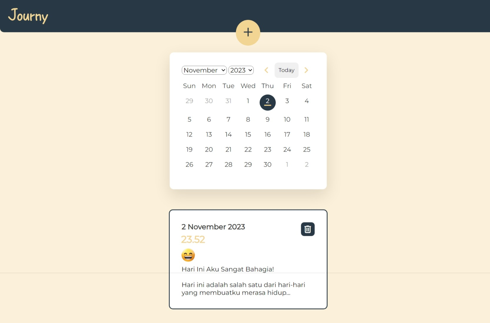

# Journy: Aplikasi Diary untuk Kesehatan Mental

Journy adalah aplikasi web sederhana yang memungkinkan pengguna mencatat diary mereka. Ini adalah alat yang dirancang untuk mendukung kesehatan mental dengan memberikan platform untuk mencatat perasaan, pemikiran, dan pengalaman sehari-hari.

## Latar Belakang

Membuat buku harian atau diary memiliki banyak manfaat bagi kesehatan mental. Menurut artikel yang diterbitkan oleh Universitas Airlangga, beberapa manfaat dari membuat buku harian bagi kesehatan mental meliputi:

- Memberikan kejelasan dan fokus.
- Meningkatkan suasana hati.
- Memprioritaskan ketakutan, masalah, dan kekhawatiran.
- Melacak gejala gangguan mental.
- Merencanakan pemulihan mental.
- Memberi ruang dan waktu untuk fokus pada diri sendiri.
- Merelakan dan melepaskan masa lalu.
- Menciptakan dialog yang positif dengan diri sendiri.
- Memberikan pandangan yang jelas tentang pola pikir dan perilaku Anda.

[Artikel Universitas Airlangga](https://www.ners.unair.ac.id/site/index.php/news-fkp-unair/30-lihat/916-kebiasaan-journaling-untuk-kesehatan-mental)

## Fitur-fitur

- **Tambah Diary**: Pengguna dapat menambahkan diary baru dengan mengklik tombol "Tambah" pada navigasi bar.

- **Mood Selector**: Ketika menambahkan diary baru, pengguna dapat memilih tingkat mood mereka melalui mood selector yang terdiri dari lima opsi.

- **Isi Diary**: Pengguna dapat mencatat isi diary mereka, menulis tentang pengalaman, pemikiran, atau perasaan mereka.

- **Simpan Diary**: Diary yang telah ditulis dapat disimpan dengan mengklik tombol "Simpan".

- **Kalender Diary**: Kalender di bawah daftar entry menampilkan tanggal di mana pengguna telah membuat diary. Garis kuning menandai tanggal tersebut.

- **Edit Diary**: Pengguna dapat mengedit diary yang telah dibuat dengan mengklik entri pada daftar entry. Mereka dapat mengklik tombol "Edit" di jendela detail entri dan menyimpan perubahan.

## Cara Menggunakan Aplikasi

1. Buka aplikasi dengan mengakses [URL Aplikasi](https://rennn9.github.io/Journy/).

2. Klik tombol "Tambah" pada navigasi bar untuk membuat diary baru.

3. Pilih mood, isi diary, dan klik "Simpan" untuk menyimpan diary baru.

4. Di bawah kalender, Anda dapat melihat daftar entri diary yang telah dibuat. Klik entri untuk melihat detail atau mengedit.

---
